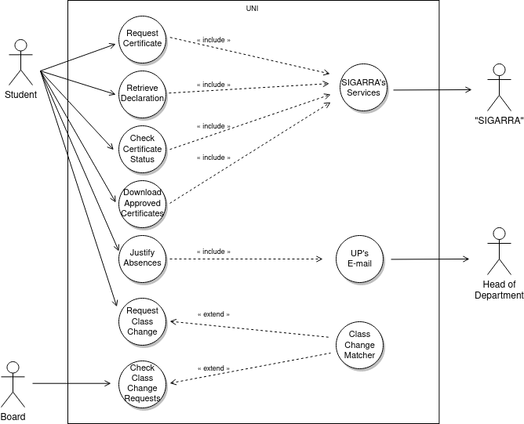

# Use Case Model  

## UML diagram

|||
| --- | --- |
| *Name* | Request Certificate |
| *Actor* |  Student | 
| *Description* | The customer purchases one or more tickets for an event, using an electronic payment method, having the option to choose places. |
| *Preconditions* | - The customer has electronic payment means.   - The event has tickets available on-sale. |
| *Postconditions* | - The customer gets the electronic tickets with a QR code.   - The customer is charged of the tickets’ cost, and the seller credited.   - Information of tickets sold & seats available for the event is updated. |
| *Normal flow* | 1. The customer accesses the web page of the ticketing system.  2. The system shows the list of events with tickets on-sale.  3. The customer selects the event and the number of tickets.  4. If wanted, the costumer may Choose Places.  5. The system shows the total price to pay.  6. The system redirects the customer to Electronic Payment.  7. The system delivers the electronic tickets to the customer with a unique identifier and QR code. |
| *Alternative flows and exceptions* | 1. [Payment failure] If, in step 6 of the normal flow the payment fails, the system gives the user the possibility to cancel or retry. |

  

|||
| --- | --- |
| *Name* | Retrieve Declaration |
| *Actor* |  Student | 
| *Description* | The customer purchases one or more tickets for an event, using an electronic payment method, having the option to choose places. |
| *Preconditions* | - The customer has electronic payment means.   - The event has tickets available on-sale. |
| *Postconditions* | - The customer gets the electronic tickets with a QR code.   - The customer is charged of the tickets’ cost, and the seller credited.   - Information of tickets sold & seats available for the event is updated. |
| *Normal flow* | 1. The customer accesses the web page of the ticketing system.  2. The system shows the list of events with tickets on-sale.  3. The customer selects the event and the number of tickets.  4. If wanted, the costumer may Choose Places.  5. The system shows the total price to pay.  6. The system redirects the customer to Electronic Payment.  7. The system delivers the electronic tickets to the customer with a unique identifier and QR code. |
| *Alternative flows and exceptions* | 1. [Payment failure] If, in step 6 of the normal flow the payment fails, the system gives the user the possibility to cancel or retry. |

  

|||
| --- | --- |
| *Name* | Check Certificate Status |
| *Actor* |  Student | 
| *Description* | The student requests to check the status of their certificate request. |
| *Preconditions* | - The student has issued a certificate request. |
| *Postconditions* | - The student is informed of the status of their certificate requests. |
| *Normal flow* | 1. The student accesses the app page relative to viewing all certificate request's status. 2. The system presents the status of the certificate requests to the student.|
| *Alternative flows and exceptions* | N/A |

  

|||
| --- | --- |
| *Name* | Download Approved Certificates |
| *Actor* |  Student | 
| *Description* | Download an available certificate from SIGARRA to the user's device. |
| *Preconditions* | - There should be at least one available certificate to be downloaded. |
| *Postconditions* | - The user gets the certificate as a pdf document. |
| *Normal flow* | 1. The user accesses the available certificates page of app.   2. The app shows the list of certificates and available certificates display a download option.   3. The user selects the download button for their desired certificate.   4. The pdf file is downloaded to the user's device. |
| *Alternative flows and exceptions* | 1. [SIGARRA fails to send the file] An error message is displayed in place of step 4. |

  

|||
| --- | --- |
| *Name* | Justify Absences |
| *Actor* | Student |
| *Description* | The student justifies one or more absences from classes |
| *Preconditions* | - The student was absent in one or more classes |
| *Postconditions* | - An email gets sent from the student's university email to the relevant faculty member |
| *Normal flow* | 1. The student accesses the app page for justifying absences.   2. The student fills a form with the relevant information needed to justify the absence.   3. The app sends an email from the student's university email to the relevant faculty member that should process the request. |
| *Alternative flows and exceptions* | N/A |

  

|||
| --- | --- |
| *Name* | Request Class Change |
| *Actor* |  Student | 
| *Description* | The student request a change from class X into class Y, in a certain course unit. |
| *Preconditions* | - The student is enrolled in the unit and in class X.   - Class X is assigned to students of that year.   - The new class's schedule does not interfere with the existing student's schedule. |
| *Postconditions* | - Information about available exchanges is updated. |
| *Normal flow* | 1. The student accesses the "Request Class Change" page.  2. The student fills in a form with the information of the course unit, their current class and the class they wish to change to.  3. UNI updates its current available class changes.  4. UNI finds possible matches to the request within its database. |
| *Alternative flows and exceptions* | 1. [Verify status] If, in step 1 the user does not fill the form, they may check all currently active class changes. |

  

|||
| --- | --- |
| *Name* |  Check Class Change Request |
| *Actor* |  Board | 
| *Description* | The board has received a class change request from a student and has to accept or refuse the request |
| *Preconditions* | - A valid request has been received |
| *Postconditions* | - The student is notified of the decision made on their request   - The student making the request is moved to the class they requested, if possible   - The student is removed from the class they were originally in, provided the request was accepted |
| *Normal flow* | 1. The board accesses the "Class Change Requests" tab   2. The application shows the list of requests not yet handled   3. The board selects whether to allow/refuse the request   4. The system changes (or not) the student's class|
| *Alternative flows and exceptions* | 1. [Put on hold for vacancies] If the class the student wishes to change to has no vacancies left, they are put on a waiting list until a student from the target class chooses to trade classes with them |